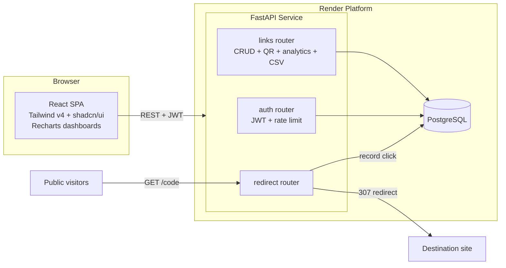

<div align="center">

# 🔗 NexusLinks

**A high-performance URL shortener with built-in Link Intelligence.**

Short links are just the beginning — every link gets a live analytics dashboard: click trends, device & browser breakdowns, traffic sources, a weekday×hour engagement heatmap, UTM campaign tagging, and CSV export.

`FastAPI` · `React 19` · `Tailwind CSS v4` · `shadcn/ui` · `PostgreSQL` · `Render`

</div>

---

## ✨ Features

| Area | Capabilities |
|---|---|
| **Link management** | Auto-generated slugs (crypto-random), custom vanity slugs, titles, expiry dates, one-click copy |
| **📊 Link Intelligence** | Daily click time-series, referrer breakdown, device & browser detection, weekday×hour heatmap, CSV export, 15s live auto-refresh |
| **UTM builder** | Tag `utm_source` / `utm_medium` / `utm_campaign` directly in the create-link dialog |
| **Auth** | JWT bearer tokens (bcrypt hashing), password strength policy, login rate limiting |
| **Security** | Per-user ownership scoping, open-redirect protection, strict CORS, production config validation at boot |
| **UX** | Dark/light theme, skeleton loaders, toast feedback, responsive layout |

## 🗺 Architecture



### Request lifecycle

1. **Create** — the SPA posts to `/links/`; the backend validates the URL scheme (http/s only), checks slug collisions, and stores the link scoped to the owner's user id.
2. **Share** — the short link points at the API origin. Anyone hitting `/{short_code}` is transparently redirected (`307`) while the click counter increments and an analytics row is written (referrer + user-agent).
3. **Analyze** — the dashboard polls `/links/{id}/analytics`, which aggregates raw clicks into daily series, referrer/device/browser counts and a weekday×hour heatmap. Raw data exports as CSV.

### Project structure

```
├── backend/
│   ├── app/
│   │   ├── main.py          # FastAPI app, CORS, routers
│   │   ├── config.py        # Env-driven settings + prod validation
│   │   ├── database.py      # SQLAlchemy engine/session (SQLite | Postgres)
│   │   ├── models.py        # User, LinkModel, ClickAnalytics
│   │   ├── schemas.py       # Pydantic validation (password policy, slug rules)
│   │   ├── security.py      # JWT + bcrypt
│   │   ├── url_safety.py    # Open-redirect guard
│   │   ├── ratelimit.py     # Sliding-window rate limiter
│   │   └── user_agents.py   # Device/browser classification
│   ├── tests/               # pytest suite
│   └── requirements.txt
├── frontend/
│   └── src/
│       ├── api/             # Axios client + interceptors
│       ├── components/
│       │   ├── ui/          # shadcn/ui primitives
│       │   ├── layout/      # Navbar, ProtectedRoute
│       │   └── dashboard/   # Charts, heatmap, table, dialogs
│       ├── context/         # AuthContext
│       ├── lib/             # cn(), formatting helpers
│       └── pages/           # Landing, Login, Register, Dashboard, LinkDetail
└── render.yaml              # One-click Render blueprint
```

## 🚀 Getting started

**Prerequisites:** Python 3.11+, Node 20+

### Backend

```bash
cd backend
python -m venv .venv && .venv\Scripts\activate   # macOS/Linux: source .venv/bin/activate
pip install -r requirements.txt
copy .env.example .env                            # then set SECRET_KEY

uvicorn app.main:app --reload                     # http://localhost:8000
```

SQLite is used by default; set `DATABASE_URL` to a Postgres connection string for production.

### Frontend

```bash
cd frontend
npm install
npm run dev                                       # http://localhost:5173
```

Set `VITE_API_URL=https://your-api.onrender.com` in `frontend/.env` when pointing at a remote API.

### Tests

```bash
cd backend && python -m pytest tests -q           # backend suite
cd frontend && npm test                           # frontend suite
```

## 📡 API reference

| Method | Endpoint | Auth | Description |
|---|---|---|---|
| `POST` | `/auth/register` | — | Create account → JWT |
| `POST` | `/auth/login` | — | Obtain JWT |
| `GET` | `/auth/users/me` | ✅ | Current user profile |
| `POST` | `/links/` | ✅ | Create link (custom slug, expiry) |
| `GET` | `/links/` | ✅ | List *your* links |
| `GET` | `/links/{id}` | ✅ | Link detail |
| `PUT` | `/links/{id}` | ✅ | Update link |
| `DELETE` | `/links/{id}` | ✅ | Delete link + its clicks |
| `GET` | `/links/{id}/qr` | ✅ | PNG QR code |
| `GET` | `/links/{id}/analytics?days=30` | ✅ | Full intelligence report |
| `GET` | `/links/{id}/export` | ✅ | Click stream as CSV |
| `GET` | `/{short_code}` | — | Public redirect + click tracking |
| `GET` | `/health` | — | Liveness probe |

Interactive docs: `/docs` (Swagger UI) on the API origin.

## ☁️ Deploying to Render

1. Push this repo to GitHub.
2. In Render: **New → Blueprint** and select the repo — `render.yaml` provisions the API, a free PostgreSQL instance and the static frontend.
3. Fill the two prompts:
   - `CORS_ORIGINS` → your frontend URL (e.g. `https://nexuslinks-web.onrender.com`)
   - `VITE_API_URL` → your API URL (e.g. `https://nexuslinks-api.onrender.com`)

The API ships with `/health` for Render health checks and refuses insecure production configs (default secrets, wildcard CORS) at boot.

## 🔒 Security notes

- Secrets come from environment variables only; production boots fail fast on defaults.
- All link endpoints enforce per-user ownership; foreign IDs return identical 404s (no existence leaks).
- Redirect targets must be absolute `http(s)` URLs — scheme injection vectors are rejected at creation *and* at redirect time (defence in depth).
- Login/register share one error message (no user enumeration) and are IP rate-limited (10 per 5 min).
- Passwords: bcrypt + minimum entropy policy (8+ chars, letters & numbers).

## License

MIT © NexusLinks contributors
